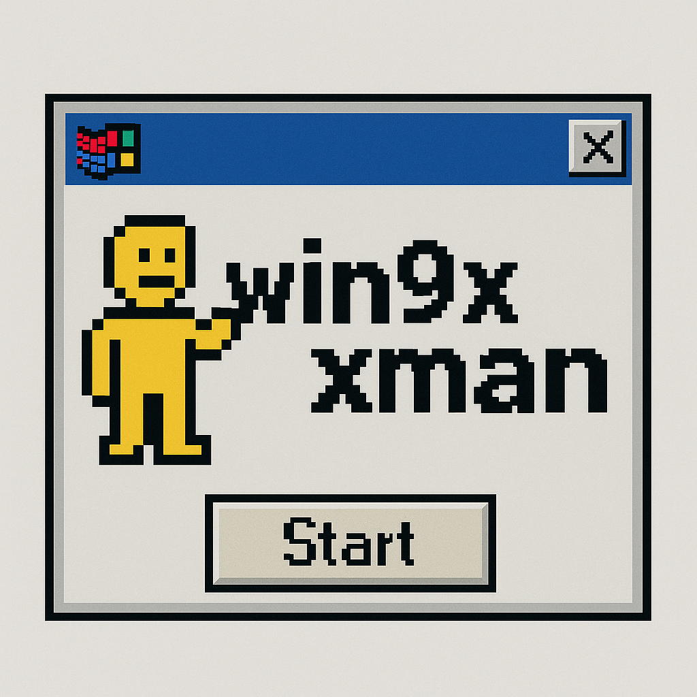

# Windows 9x Manager

A Python-based GUI tool for running Windows 95/98 in DOSBox-X with advanced management features.



## Overview

Windows 9x Manager provides a user-friendly GUI for running Windows 95 and 98 in DOSBox-X. It handles disk image creation, ISO mounting, snapshots, and performance tuning to make retro Windows usage seamless and accessible.

## Features

- **Modern Python Interface**: Easy to use Tkinter GUI
- **Dual OS Support**: Handles both Windows 95 and Windows 98
- **Easy Installation**: Boot directly from installation ISO files
- **HDD Image Management**: Create and format hard disk images with customizable sizes
- **Snapshot System**: Save and restore system states with named snapshots
- **CD-ROM Support**: Mount ISO files to install software or games
- **User-friendly Interface**: Simple, cross-platform GUI

## Requirements

- Python 3.6 or higher
- DOSBox-X (https://dosbox-x.com/)
- Tkinter (usually included with Python)

## Installation

1. Clone this repository:
   ```
   git clone https://github.com/yourusername/win9xman.git
   cd win9xman
   ```

2. Make sure you have Python 3.6+ installed:
   ```
   python --version
   ```

3. Install DOSBox-X for your platform if not already installed:
   - Windows: Download from [DOSBox-X website](https://dosbox-x.com/)
   - Linux: Use your package manager or follow instructions on DOSBox-X website
   - macOS: Use Homebrew: `brew install dosbox-x`

4. Run the Windows 9x Manager:
   ```
   python win9xman.py
   ```
   
   On Linux/macOS you can make it executable first:
   ```
   chmod +x win9xman.py
   ./win9xman.py
   ```

## Directory Structure

- `win9xman.py` - Main Python launcher script
- `config/` - Configuration files directory
  - `dosbox.conf` - DOSBox-X configuration file
- `win98_drive/` - Directory for Windows 98 files (optional)
- `win95_drive/` - Directory for Windows 95 files (optional)
- `iso/` - Directory for ISO files
- `disks/` - Directory for disk images
- `snapshots/` - Directory for Windows 98 snapshots
- `snapshots_win95/` - Directory for Windows 95 snapshots
- `assets/` - Icons and graphics for the application

## Usage Guide

### First-time Setup

1. Run `win9xman.py`
2. Select your Windows version (95 or 98)
3. Click "Install Windows from ISO"
4. Choose your Windows installation ISO
5. Follow the Windows setup process

### Creating Snapshots

1. Make changes to your Windows system
2. Exit to the launcher
3. Select "Create Snapshot"
4. Enter a name for your snapshot

### Restoring Snapshots

1. Select "Restore Snapshot" from the launcher
2. Choose the snapshot you wish to restore
3. Confirm the restoration

## Troubleshooting

- **DOSBox-X not found**: Ensure DOSBox-X is installed and in your PATH
- **Windows fails to install**: Ensure your disk image is large enough
- **Installation errors**: Try the "Format Hard Disk" option to create a fresh disk image
- **UI errors**: Make sure you have Tkinter installed (`python -m tkinter` should show a test window)

## Development

To contribute to Windows 9x Manager:

1. Fork the repository
2. Create a feature branch
3. Add your changes
4. Submit a pull request

## License

This project is licensed under the MIT License - see the LICENSE file for details.

## Credits

- DOSBox-X team for the amazing emulator
- Contributors to this project

---

Created with ❤️ for DOS/Windows nostalgia enthusiasts
