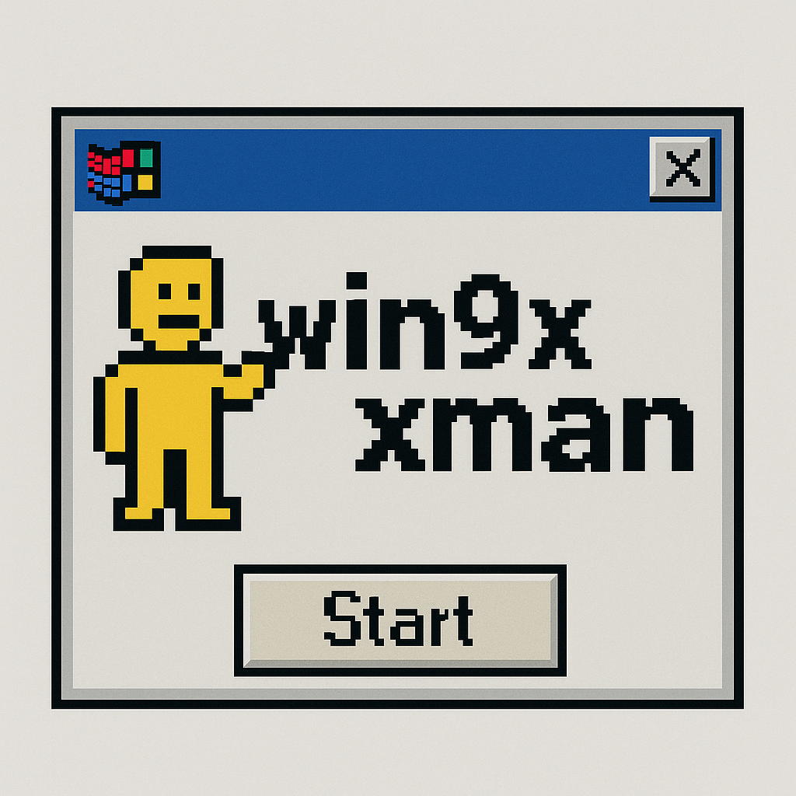

# DOSBox-X Windows 9x Manager

A graphical launcher tool for running Windows 95/98 in DOSBox-X with advanced management features.



## Overview

DOSBox-X Windows Manager provides a user-friendly GUI for running Windows 95 and 98 in DOSBox-X. It handles disk image creation, ISO mounting, snapshots, and performance tuning to make retro Windows usage seamless and accessible.

## Features

- **Easy Installation**: Boot directly from installation ISO files
- **HDD Image Management**: Create and format hard disk images with customizable sizes
- **Snapshot System**: Save and restore system states with named snapshots
- **CD-ROM Support**: Mount ISO files to install software or games
- **Performance Tuning**: Optimize DOSBox-X settings for Windows 95 (in win95_launcher)
- **User-friendly Interface**: Simple GUI powered by Zenity

## Requirements

- DOSBox-X (https://dosbox-x.com/)
- Zenity for GUI dialogs
- Bash shell
- Windows 95/98 installation media (ISO format)

## Installation

1. Clone this repository:
   ```
   git clone https://github.com/yourusername/dosbox-x-windows-manager.git
   cd dosbox-x-windows-manager
   ```

2. Make the launcher scripts executable:
   ```
   chmod +x win98_launcher.sh win95_launcher.sh
   ```

3. Run the appropriate launcher:
   ```
   # For Windows 98:
   ./win98_launcher.sh
   
   # For Windows 95:
   ./win95_launcher.sh
   ```

## Directory Structure

- `win98_launcher.sh` - Windows 98 launcher script
- `win95_launcher.sh` - Windows 95 launcher script
- `dosbox.conf` - DOSBox-X configuration file
- `win98_drive/` - Directory for Windows 98 files (optional)
- `win95_drive/` - Directory for Windows 95 files (optional)
- `iso/` - Directory for ISO files
- `disks/` - Directory for disk images
- `snapshots/` - Directory for Windows 98 snapshots
- `snapshots_win95/` - Directory for Windows 95 snapshots

## Usage Guide

### First-time Setup

1. Run the launcher for your Windows version
2. Select "Boot from Windows 9x ISO" option
3. Choose your Windows installation ISO
4. Follow the Windows setup process

### Creating Snapshots

1. Make changes to your Windows system
2. Exit to the launcher
3. Select "Create snapshot of current disk image"
4. Enter a name for your snapshot

### Restoring Snapshots

1. Select "Restore snapshot" from the launcher
2. Choose the snapshot you wish to restore
3. Confirm the restoration

## Performance Tuning (Windows 95)

The Windows 95 launcher includes performance tuning options:

- **Standard**: Balanced settings for most users
- **Fast**: Better performance but less accuracy
- **Accurate**: Slower but more accurate emulation

## Troubleshooting

- **Windows fails to install**: Ensure your disk image is large enough
- **Installation errors**: Try the "Format C: drive" option to create a fresh disk image
- **Performance issues**: Use the tuning options in the Windows 95 launcher

## License

This project is licensed under the MIT License - see the LICENSE file for details.

## Credits

- DOSBox-X team for the amazing emulator
- Contributors to this project

---

Created with ❤️ for DOS/Windows nostalgia enthusiasts
